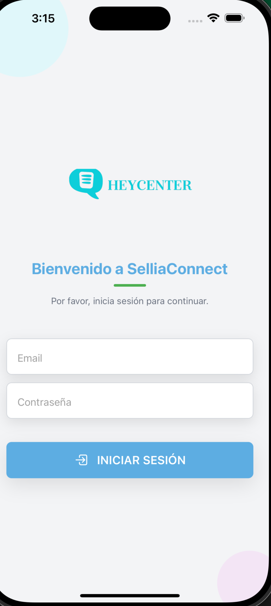

# 📱 Take-home Coding Challenge

Bienvenido al desafío de desarrollo, construido en [Expo](https://expo.dev/) para una experiencia de desarrollo rápida y eficaz en aplicaciones móviles con React Native.

## 🛠️ Instalación y configuración del ambiente

### Instalación de Dependencias

Para empezar, asegúrate de tener [Node.js](https://nodejs.org/) instalado. Luego, sigue estos pasos para instalar las dependencias necesarias:

1. Clona el repositorio y navega a la carpeta del proyecto:

   ```bash
   git clone <URL_DEL_REPOSITORIO>
   cd <NOMBRE_DEL_PROYECTO>
   ```

2. Instala las dependencias:

   ```bash
   npm install
   ```

### Ejecución del Proyecto

Inicia la aplicación en modo de desarrollo con el siguiente comando:

```bash
npx expo start -c
```

## 📂 Estructura del Proyecto

El desarrollo principal se encuentra en la carpeta **app**, utilizando enrutamiento basado en archivos para facilitar la navegación y organización.

## 💡 Coding Challenge

Este proyecto forma parte de un Take-home Coding Challenge para demostrar habilidades en React y React Native. Se ha creado una estructura de diseño adaptable tanto para versiones web como móvil, con capturas adjuntas para ambas.

## 📋 Guía de Estilos y Accesibilidad

Este proyecto emplea una paleta de colores optimizada para accesibilidad, cumpliendo con estándares de contraste y usabilidad:

- **Color Primario**: `#5dade2` – Botones principales y elementos destacados.
- **Color Secundario**: `#4A90E2` – Navegación y encabezados.
- **Fondos**: Colores claros (`#f3f4f6`, `#ffffff`) para reducir fatiga visual.
- **Texto**: Tonos oscuros (`#11181C`) y claros (`#ECEDEE`) en función del fondo.

## 📱 Aplicación Android/iOS

El proyecto está configurado para visualizarse en web y dispositivos móviles. Para este ejemplo, se generó la versión Android, y se adjuntan capturas de pantalla.

## 📚 Recursos y Documentación

<p align="center">
  
</p>
